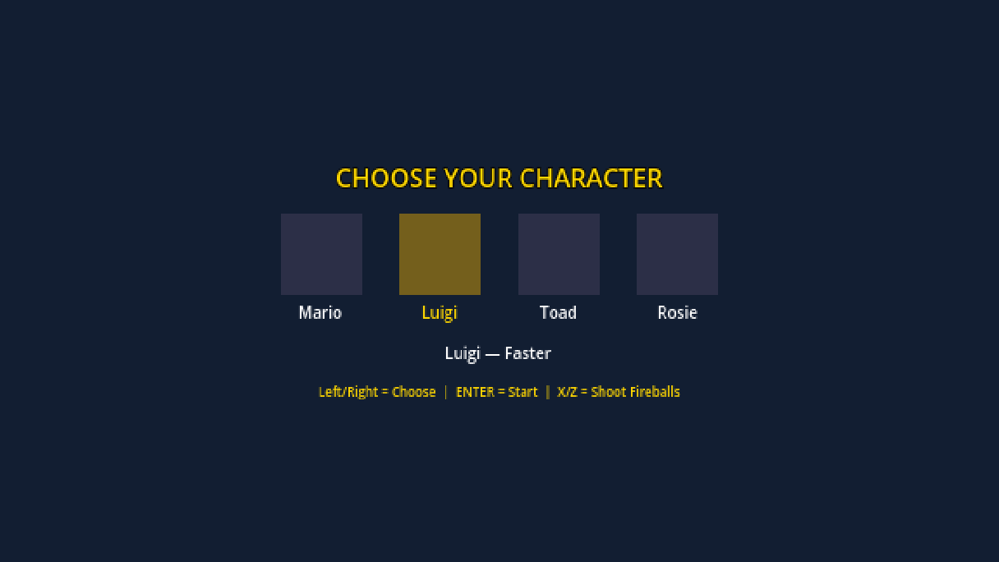
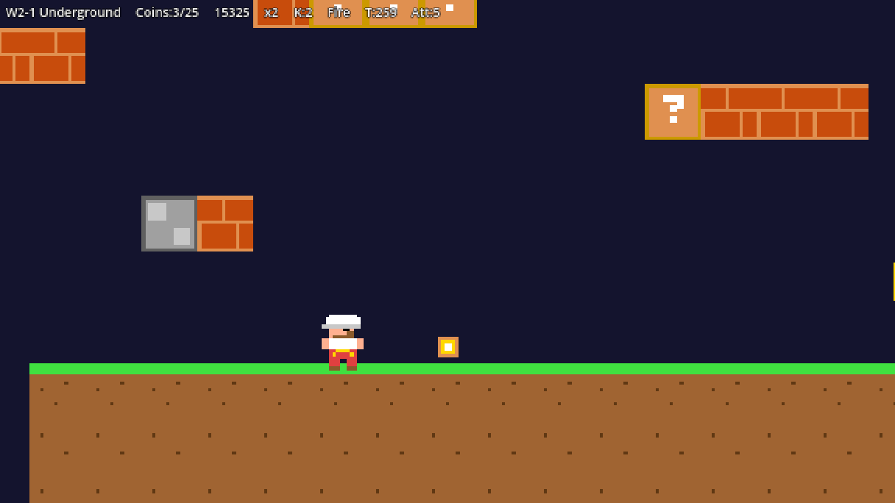

# 🍄 Mario Coin Collector

A retro-inspired 2D platformer game where you choose your favorite character and run, jump, and shoot fireballs through challenging levels to collect coins!

## 🎮 Game Overview

Mario Coin Collector is a classic side-scrolling platformer that pays tribute to the timeless Mario series. Pick from four iconic characters, each with their own unique abilities, and venture through underground worlds filled with bricks, mystery blocks, coins, and surprises.

## 📸 Screenshots

### 🏠 Main Menu — Character Selection
Choose your hero before starting your adventure. Each character has different abilities!



**Characters available:**
- **Mario** — The balanced classic hero
- **Luigi** — Faster than the rest
- **Toad** — Light and nimble
- **Rosie** — A unique playstyle

---

### 🔥 Advanced Gameplay — Fire Power
Power up and shoot fireballs to defeat enemies in the underground levels!



In this screenshot you can see the **W2-1 Underground** level featuring:
- HUD with coin counter (3/25), score (15325), and active power-ups (x2, K2, Fire, T259, Ate5)
- Brick platforms and mystery `?` blocks
- Collectible coins scattered across the level
- The player character with active fire power-up

## 🕹️ Controls

| Key | Action |
|-----|--------|
| **← / →** | Choose Character / Move |
| **ENTER** | Start Game |
| **X / Z** | Shoot Fireballs |

## ✨ Features

- 🎨 Retro pixel-art style graphics
- 👥 Four playable characters with unique stats
- 🔥 Power-ups including fire to shoot fireballs
- 💰 Coin collection system with score tracking
- 🧱 Classic platforming elements: bricks, `?` blocks, and hidden goodies
- 🌍 Multiple worlds and levels (e.g., W2-1 Underground)

## 🚀 Getting Started

### Installation

```bash
# Clone the repository
git clone https://github.com/RandomMoaz/MarioCoinCollector-project.git

# Navigate into the project directory
cd MarioCoinCollector-project

# Run the game
# (add your run command here)
```

## 🎯 How to Play

1. Launch the game.
2. Use the **Left/Right arrow keys** to highlight your preferred character.
3. Press **ENTER** to start the adventure.
4. Run, jump, and collect coins while avoiding obstacles.
5. Grab the fire power-up and press **X** or **Z** to shoot fireballs!
6. Collect all 25 coins in each level to maximize your score.

## 🤝 Contributing

Contributions, issues, and feature requests are welcome! Feel free to fork the repo and submit a pull request.

## 👤 Author

**RandomMoaz**
- GitHub: [@RandomMoaz](https://github.com/RandomMoaz)

---

⭐ If you enjoyed this game, give the repo a star!
